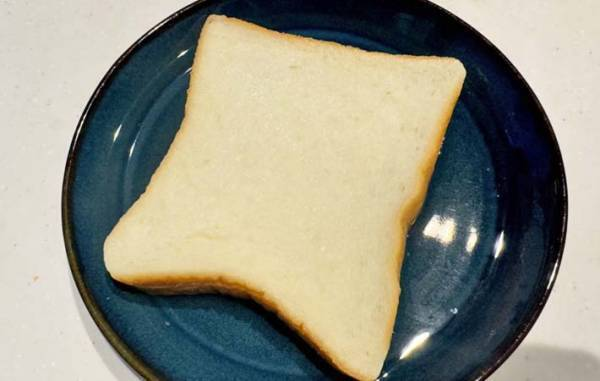
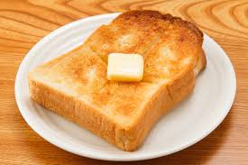
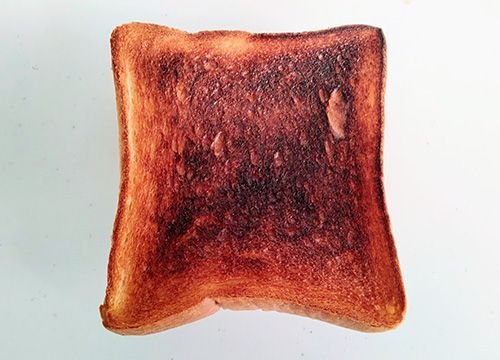
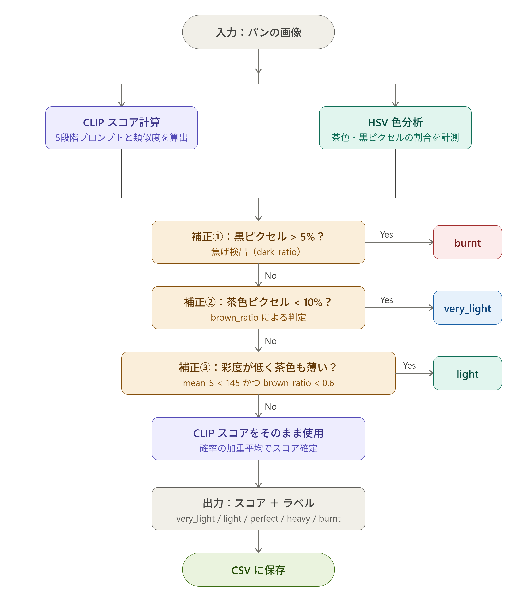

# 🍞 Toast Doneness Classifier

**CLIP と色分析を組み合わせた食パンの焼き加減自動判定システム**

ポップアップトースターを持っていなくても、パンの焼き色を AI が自動で判定してくれるスクリプトです。  
Webブラウザから利用できます。

## 🚀 Try Online

[https://huggingface.co/spaces/hiromusazuka/toast-doneness-classifier](https://hiromusazuka-toast-doneness-classifier.hf.space)

---

## 🎯 できること

画像を渡すだけで、焼き加減を 5 段階で判定します。

| スコア | ラベル | 状態 |
|--------|--------|------|
| 0.00 | `very_light` | ほぼ焼けていない |
| 0.25 | `light` | 薄いきつね色 |
| 0.50 | `perfect` | ちょうどよい焼き色 |
| 0.75 | `heavy` | やや焼きすぎ |
| 1.00 | `burnt` | 焦げている |

---


## 🧪 判定結果のサンプル

<table>
<tr>
<td align="center">
<br>
very_light<br>
score=0.462
</td>

<td align="center">
<br>
perfect<br>
score=0.511
</td>

<td align="center">
<br>
heavy<br>
score=0.595
</td>
</tr>
</table>


## 🔧 使用技術

- **[CLIP](https://github.com/openai/CLIP)** （OpenAI）― 画像とテキストの照合モデル
- **Pytorch**
- **OpenCV** ― HSV 色空間による茶色ピクセル分析
- **Google Colaboratory** ― 実行環境（GPU 対応）
- **Gradio**
- **Hugging Face Spaces** ― 実行環境（GPU 対応）
  

---

## 📂 ファイル構成

```
toast-judge/
├── README.md          # このファイル
├── toast_judge.py     # メインスクリプト
├── requirements.txt   # 依存パッケージ
└── .gitignore
```

---

## 🚀 使い方

### 1. Google Colab で開く

[](https://colab.research.google.com/)

### 2. 依存パッケージのインストール

```python
!pip install ftfy regex tqdm
!pip install git+https://github.com/openai/CLIP.git
```

### 3. Google Drive をマウント

```python
from google.colab import drive
drive.mount('/content/drive')
```

### 4. 画像フォルダのパスを設定

```python
folder_path = "/content/drive/MyDrive/あなたのフォルダ名/bread"
```

### 5. 実行

```python
batch_predict_to_csv(folder_path, "toast_results.csv")
```

結果は CSV ファイルにも保存されます。

---

## 📊 判定ロジック（概要）

```
入力画像
  │
  ├─ CLIP スコア計算
  │     テキストプロンプト（5段階）との類似度を計算
  │
  ├─ 色分析（HSV 空間）
  │     茶色ピクセルの割合・分布・彩度・明度を分析
  │
  └─ 補正ルール適用
        ・黒ピクセルが多い → burnt に補正
        ・茶色ピクセルが少ない → very_light に補正
        └ 最終スコアを出力
```

詳細なフローチャートは下の図を参照してください。
（下の図は変更前です。一部誤りがあります。）

<p align="center">
  
</p>
---


## ⚠️ 既知の課題と今後の展望

-撮影環境や照明条件によって判定結果が変化する場合があります
-トースト以外のパンでは精度が低下する可能性があります
-CLIPのテキストプロンプト設計に結果が影響されます

---

## 📝 背景

画像認識モデルCLIPを利用し、日常的な題材である「トーストの焼き加減判定」をテーマに実装しました。

---

## 📄 ライセンス

MIT License
